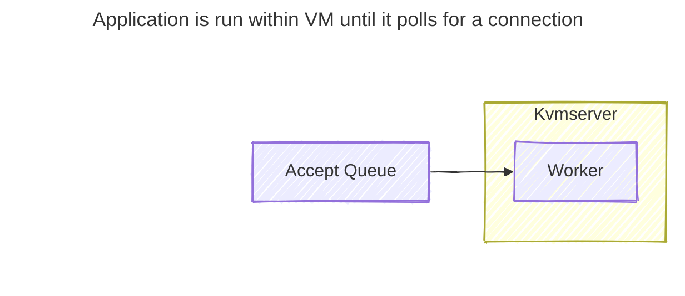
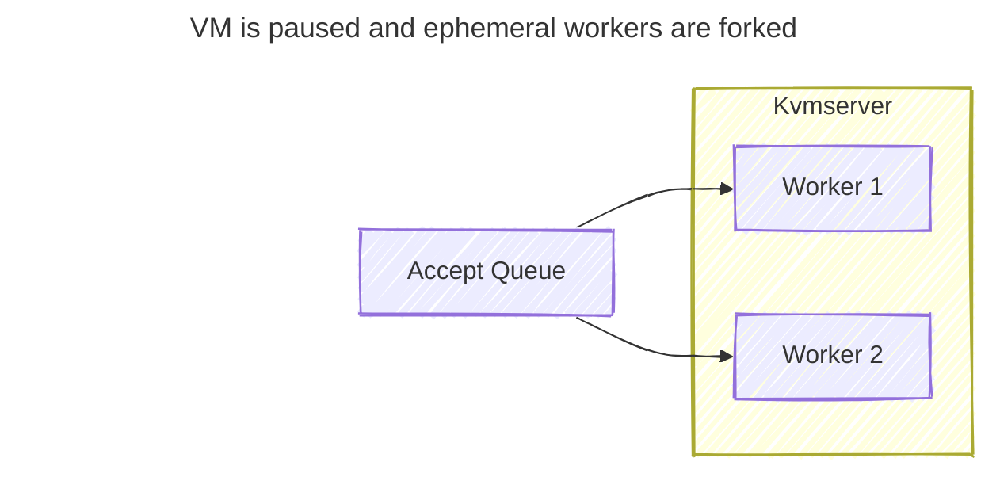
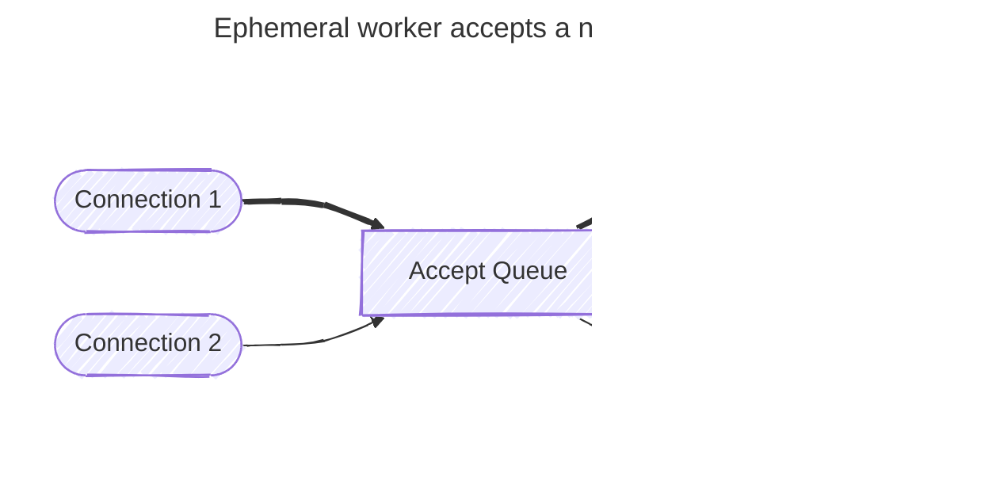
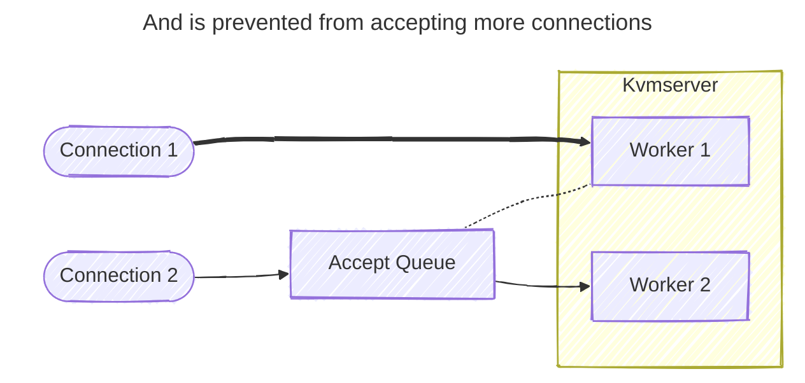
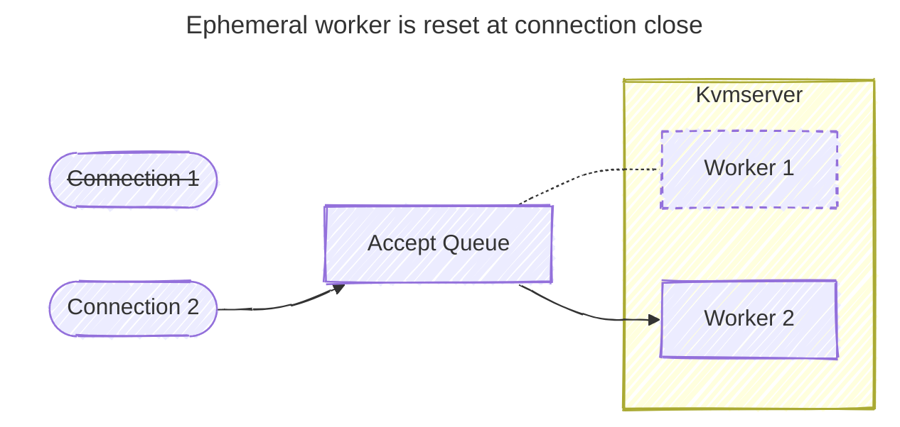
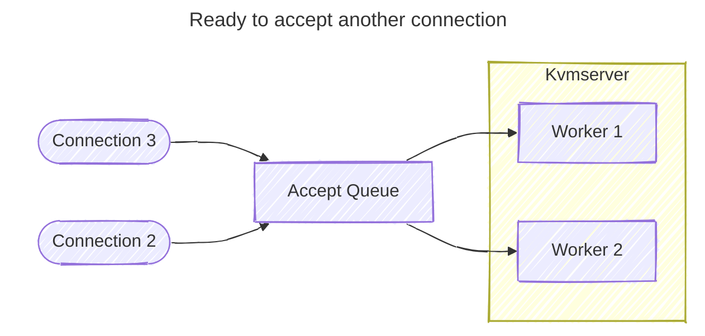

# Kvmserver design notes

## Connection handling with ephemeral workers

```mermaid
---
title: Application is run within VM until it polls for a connection
config:
  look: handDrawn
---
graph LR
  subgraph Incoming[ ]
    C1([Connection 1])
    C2([Connection 2])
  end
  Q[Accept Queue]
  subgraph Kvmserver
    W1[Worker]
  end
  C1 ~~~ Q
  C2 ~~~ Q
  Q --> W1
style Incoming fill:transparent, stroke-width:0px
style C1 fill:transparent, stroke-width:0px, color:transparent
style C2 fill:transparent, stroke-width:0px, color:transparent
```

```mermaid
---
title: VM is paused and ephemeral workers are forked
config:
  look: handDrawn
---
graph LR
  subgraph Incoming[ ]
    C1([Connection 1])
    C2([Connection 2])
  end
  Q[Accept Queue]
  subgraph Kvmserver
    W1[Worker 1]
    W2[Worker 2]
  end
  C1 ~~~ Q
  C2 ~~~ Q
  Q --> W1
  Q --> W2
style Incoming fill:transparent, stroke-width:0px
style C1 fill:transparent, stroke-width:0px, color:transparent
style C2 fill:transparent, stroke-width:0px, color:transparent
```

```mermaid
---
title: Ephemeral worker accepts a new connection
config:
  look: handDrawn
---
graph LR
  subgraph Incoming[ ]
    C1([Connection 1])
    C2([Connection 2])
  end
  Q[Accept Queue]
  subgraph Kvmserver
    W1[Worker 1]
    W2[Worker 2]
  end
  C1 ==> Q
  C2 --> Q
  Q ==> W1
  Q --> W2
style Incoming fill:transparent, stroke-width:0px
```

```mermaid
---
title: And is prevented from accepting more connections
config:
  look: handDrawn
---
graph LR
  subgraph Incoming[ ]
    C1([Connection 1])
    C2([Connection 2])
  end
  Q[Accept Queue]
  subgraph Kvmserver
    W1[Worker 1]
    W2[Worker 2]
  end
  C1 ==> W1
  C1 ~~~ Q
  C2 --> Q
  Q .- W1
  Q --> W2
style Incoming fill:transparent, stroke-width:0px
```

```mermaid
---
title: Ephemeral worker is reset at connection close
config:
  look: handDrawn
---
graph LR
  subgraph Incoming[ ]
    C1([Connection 1])
    C2([Connection 2])
  end
  Q[Accept Queue]
  subgraph Kvmserver
    W1[Worker 1]
    W2[Worker 2]
  end
  C1 ~~~ Q
  C2 --> Q
  Q -.- W1
  Q --> W2
style Incoming fill:transparent, stroke-width:0px
style C1 text-decoration:line-through
style W1 stroke-dasharray: 5 5
```

```mermaid
---
title: Ready to accept another connection
config:
  look: handDrawn
---
graph LR
  subgraph Incoming[ ]
    C3([Connection 3])
    C2([Connection 2])
  end
  Q[Accept Queue]
  subgraph Kvmserver
    W1[Worker 1]
    W2[Worker 2]
  end
  C3 --> Q
  C2 --> Q
  Q --> W1
  Q --> W2
style Incoming fill:transparent, stroke-width:0px
```
