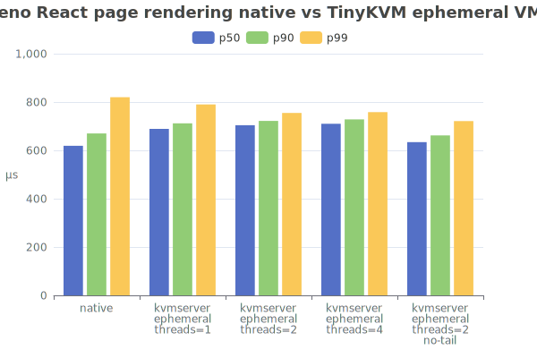

# KVM Server - Fast per-request isolation for Linux executables with TinyKVM

KVM server applies [TinyKVM](https://github.com/varnish/tinykvm)'s fast
sandboxing technology to existing unmodified Linux server executables in order
to provide per request isolation with extremely low overhead.

KVM server intercepts the programs epoll event loop, and guides new accepted
connections onto tiny forked instances of the sandboxed process. After each
request concludes, TinyKVM resets the guest to a pristine state far more quickly
than Linux is able to fork a process. TinyKVM is able to achieve such extremely
fast reset times by running the guest processes under an emulated Linux
userspace in KVM.

This approach is uniquely elegant for JIT'ed runtimes where existing options
require choosing between fast execution with virtualization (but no per-request
isolation), slow process forking, slow v8 isolates; or very very slow
interpreters like QuickJS embedded in WebAssembly.

Previous experiments with a real world React rendering benchmark have shown
runtimes in the 10s of milliseconds with WebAssembly (which does not support
JIT) or reset times of several milliseconds to either fork a process or start a
new V8 isolate. We are able to run this benchmark 1.5-2 orders of magnitude
faster than existing solutions, while running unmodified dynamic executables
taken directly from the latest version, creating a new frontier for per-request
isolation.

## Benchmarks



<details>

<summary>Detailed benchmark results</summary>

### Rust minimal http server

| name                                  | average | p50   | p90   | p99   |
| ------------------------------------- | ------- | ----- | ----- | ----- |
| native                                | 13 µs   | 11 µs | 17 µs | 20 µs |
| kvmserver threads=1                   | 23 µs   | 20 µs | 29 µs | 33 µs |
| kvmserver ephemeral threads=1         | 28 µs   | 28 µs | 30 µs | 37 µs |
| kvmserver ephemeral threads=2         | 34 µs   | 33 µs | 37 µs | 51 µs |
| kvmserver ephemeral threads=4         | 36 µs   | 35 µs | 39 µs | 57 µs |
| kvmserver ephemeral threads=2 no-tail | 28 µs   | 28 µs | 32 µs | 36 µs |

### Deno helloworld

| name                                  | average | p50   | p90   | p99   |
| ------------------------------------- | ------- | ----- | ----- | ----- |
| native (reusing connection)           | 11 µs   | 10 µs | 14 µs | 16 µs |
| native                                | 17 µs   | 15 µs | 22 µs | 29 µs |
| kvmserver threads=1                   | 33 µs   | 32 µs | 33 µs | 45 µs |
| kvmserver ephemeral threads=1         | 50 µs   | 49 µs | 53 µs | 75 µs |
| kvmserver ephemeral threads=2         | 58 µs   | 57 µs | 62 µs | 90 µs |
| kvmserver ephemeral threads=4         | 60 µs   | 59 µs | 65 µs | 90 µs |
| kvmserver ephemeral threads=2 no-tail | 41 µs   | 38 µs | 46 µs | 59 µs |

### Deno React page rendering

| name                                  | average | p50    | p90    | p99    |
| ------------------------------------- | ------- | ------ | ------ | ------ |
| native (reusing connection)           | 642 µs  | 606 µs | 673 µs | 805 µs |
| native                                | 646 µs  | 619 µs | 670 µs | 820 µs |
| kvmserver threads=1                   | 649 µs  | 619 µs | 674 µs | 798 µs |
| kvmserver ephemeral threads=1         | 695 µs  | 689 µs | 712 µs | 790 µs |
| kvmserver ephemeral threads=2         | 705 µs  | 704 µs | 722 µs | 755 µs |
| kvmserver ephemeral threads=4         | 711 µs  | 710 µs | 728 µs | 758 µs |
| kvmserver ephemeral threads=2 no-tail | 639 µs  | 634 µs | 662 µs | 721 µs |

### Benmark details

- Non-ephemeral benchmark shows the overhead of sandboxing without any reset
  between requests.
- No-tail benchmark runs with only a single load generator connection to measure
  latency excluding time spent after the response is sent to the client.
- Deno is run with `--v8-flags=--predictable` which causes all work to happen on
  thread. (At median this makes a 1.5% difference for the React benchmark and
  none for helloworld.)
- 1000 warmup requests were used to warm the JIT before benchmarking.
- `deno compile` was used to avoid starting background disk cache threads.
- The Rust minimal http server always closes connections.
- Benchmarks were run on AMD Ryzen 9 7950X (32) @ 5.881Ghz with deno 2.3.6.

</details>

## Performance characterization

The React benchmark runs with 10µs of connection creation overhead, 15µs of
sandbox execution overhead, and 55µs of sandbox reset overhead for a total of
80µs out of 690µs. Performance is more consistent since reset avoids JIT spikes.

- Execution of processes inside KVM generally runs at full speed.
- Any syscalls requiring communication with the host incur overhead of around a
  microsecond in VM context switching and permission checking.
- VM reset accounts for most of the overhead. It is tail latency incurred after
  connection close and consists of:
  - Event loop / file descriptor reset, proportional to the number of open file
    descriptors.
  - Memory reset time, proportional to the number of dirty memory pages which
    must be reset.

For simple endpoints the network stack overhead from establishing a new tcp
connection can be significant so best performance is achieved by listening on a
unix socket and serving incoming tcp connections through a reverse proxy to
enable client connection reuse.

Nested virtualization incurs additional overhead that will vary depending on the
cpu security mitigations applied. On an AMD Ryzen 7 7840HS running on Linux 6.11
we see around 200µs of additional overhead running nested under QEMU.

## Memory usage

KVM server forks are very memory efficient since they only allocate pages
written during a request (which are reset afterwards). This is great for large
programs like Deno, as a large RSS can be amortized over many forked VMs.

The main program and all dynamically linked shared objects are shared privately
with the VM in a copy-on-write manner, saving substantially on memory usage and
preventing any changes to be written back to disk.

| Program                  | RSS    | Reset   |
| ------------------------ | ------ | ------- |
| Rust minimal http server | 9 MB   | 68 KB   |
| Deno hello world         | 56 MB  | 452 KB  |
| Deno react renderer      | 107 MB | 2324 KB |

## Runtime requirements

- Access to /dev/kvm is required. This normally requires adding your user to the
  `kvm` group. Changes to group membership usually take effect at next login.

## Command line arguments

```
kvmserver [OPTIONS] [SUBCOMMANDS]


OPTIONS:
  -h,     --help              Print this help message and exit 
  -c,     --config [kvmserver.toml]  
                              Read a toml file 
          --help-all          Expand all help 
          --cwd TEXT [/home/lrowe/devel/kvmserver]  
                              Set the guests working directory 
          --env TEXT ...      add an environment variable 
  -t,     --threads UINT [1]  Number of request VMs (0 to use cpu count) 
  -e,     --ephemeral         Use ephemeral VMs 
  -w,     --warmup UINT [0]   Number of warmup requests 
          --print-config      Print config and exit without running program 

Verbose:
  -v,     --verbose           Enable verbose output 
          --verbose-syscalls  Enable verbose syscall output 
          --verbose-mmap-syscalls 
                              Enable verbose mmap syscall output 
          --verbose-thread-syscalls 
                              Enable verbose thread syscall output 
          --verbose-pagetables 
                              Enable verbose pagetable output 

Permissions:
          --allow-all Excludes: --allow-read --allow-write --allow-env --allow-net --allow-connect --allow-listen --volume 
                              Allow all access 
          --allow-read{/} Excludes: --allow-all 
                              Allow filesystem read access 
          --allow-write{/} Excludes: --allow-all 
                              Allow filesystem write access 
          --allow-env{*} Excludes: --allow-all 
                              Allow access to environment variables. Optionally specify 
                              accessible environment variables (e.g. 
                              --allow-env=USER,PATH,API_*). 
          --allow-net Excludes: --allow-all 
                              Allow network access 
          --allow-connect Excludes: --allow-all 
                              Allow outgoing network access 
          --allow-listen Excludes: --allow-all 
                              Allow incoming network access 
          --volume Excludes: --allow-all 
                              <host-path>:<guest-path>[:r?w?=r] 

Advanced:
          --max-boot-time FLOAT [20]  
          --max-request-time FLOAT [8]  
          --max-main-memory UINT [8192]  
          --max-address-space UINT [122880]  
          --max-request-memory UINT [128]  
          --limit-request-memory UINT [128]  
          --shared-memory UINT [0]  
          --heap-address-hint UINT [256]  
          --hugepage-arena-size UINT [0]  
          --hugepage-requests-arena UINT [0]  
          --no-executable-heap{false} 
          --no-mmap-backed-files{false} 
          --hugepages         
          --no-split-hugepages{false} 
          --transparent-hugepages 
          --no-ephemeral-keep-working-memory{false} 

SUBCOMMANDS:
run
  Run 
  
  
POSITIONALS:
  program TEXT REQUIRED       Program 
  args TEXT:NOT {++} ...      Program arguments 

Advanced:
          --dylink-address-hint UINT [2]  
          --remapping ...     virt:size(mb)[:phys=0][:r?w?x?=rw] 


storage
  Storage VM 
  
  
POSITIONALS:
  program TEXT REQUIRED       Storage program 
  args TEXT:NOT {++} ...      Storage arguments 

OPTIONS:
          --1-to-1            Each request VM gets its own storage VM 

Advanced:
          --ipre-permanent    Storage VM uses permanent IPRE resume images 
          --dylink-address-hint UINT [137441050624]  
          --remapping ...     virt:size(mb)[:phys=0][:r?w?x?=rw] 


snapshot
  Create snapshot 
  
  
POSITIONALS:
  program TEXT REQUIRED       Program 
  args TEXT:NOT {++} ...      Program arguments 

OPTIONS:
  -o,     --output TEXT REQUIRED 
                              Snapshot filename 

Advanced:
          --dylink-address-hint UINT [2]  
          --remapping ...     virt:size(mb)[:phys=0][:r?w?x?=rw] 


snaprun
  Run snapshot 
  
  
POSITIONALS:
  snapshot TEXT:FILE REQUIRED Snapshot 

Advanced:
          --dylink-address-hint UINT [2]  
          --remapping ...     virt:size(mb)[:phys=0][:r?w?x?=rw] 
```

## Configuration file

By default kvmserver will look for a file named `kvmserver.toml` in the current
directory and if it exists will read configuration from there.

Command line arguments and configuration are handled by
[CLI11](https://github.com/CLIUtils/CLI11) which supports a subset of
[TOML](https://toml.io/). Notably array values must be kept to a single line.

## Binary release

Binary releases may be downloaded fomr the GitHub releases page. This binary
requires glibc 2.34 or higher and should work on: Debian 12+ / Ubuntu 21.10+ /
Fedora 35+ / CentOS/RHEL 9+.

## Build from source

On debian based distributions `cmake libc6-dev g++ make` are required.

Run `make` to build `.build/kvmserver`.

## Running in Docker or Podman

The binary release is also available from GitHub Container Registry and may be
copied into your glibc based Dockerfile:

```Dockerfile
FROM debian:bookworm-slim
COPY --from=ghcr.io/libriscv/kvmserver:bin /kvmserver /usr/local/bin/
```

Give permission to access /dev/kvm when running container:

```sh
KVM_GID=$(getent group kvm | cut -d: -f3) \
docker run --rm --device /dev/kvm --group-add $KVM_GID IMAGE
```

```sh
podman run --rm --device /dev/kvm --group-add keep-groups IMAGE
```

On Ubuntu 24.04 you likely want to install a recent podman from
[podman-static](https://github.com/mgoltzsche/podman-static) and podman-compose
from [PyPI podman-compose](https://pypi.org/project/podman-compose/).

### Docker compose / podman-compose

See: [docker-compose.yml](docker-compose.yml).

Run with docker compose:

```sh
docker compose build
KVM_GID=$(getent group kvm | cut -d: -f3) docker compose up
docker compose down --volumes
```

Run with podman-compose:

```sh
podman-compose build
podman-compose up
podman-compose down --volumes
```

## Guest program considerations

KVM Server is intended for running primarily single threaded guest programs with
parallel execution handled with VM forking. There is some basic threading
support to allow guests to make progress when threads are used during startup
but threads should be avoided where possible.

For details see the integration tested example guest programs:

- [Deno](examples/deno)
- [Lune (Luau)](examples/lune)
- [Python](examples/python)
- [Rust](examples/rust)
