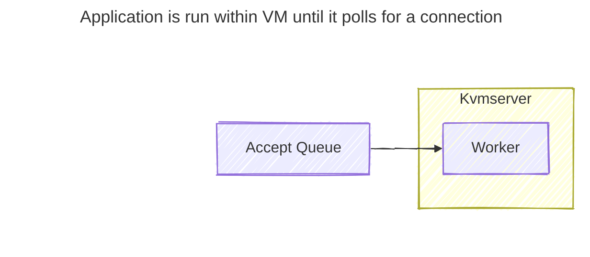
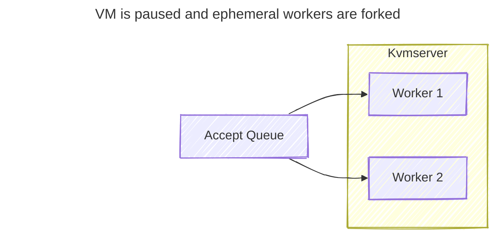
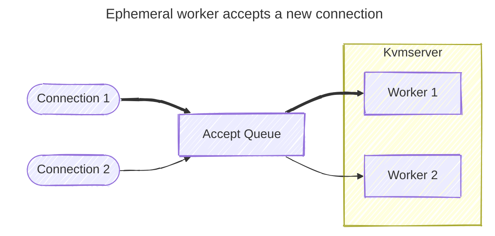
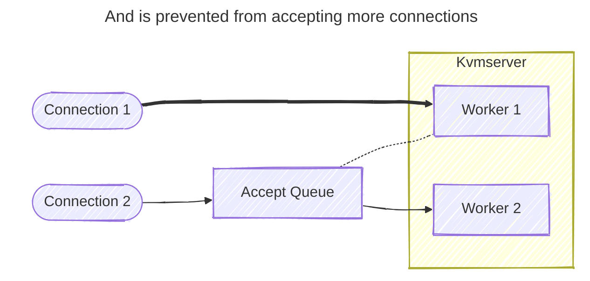
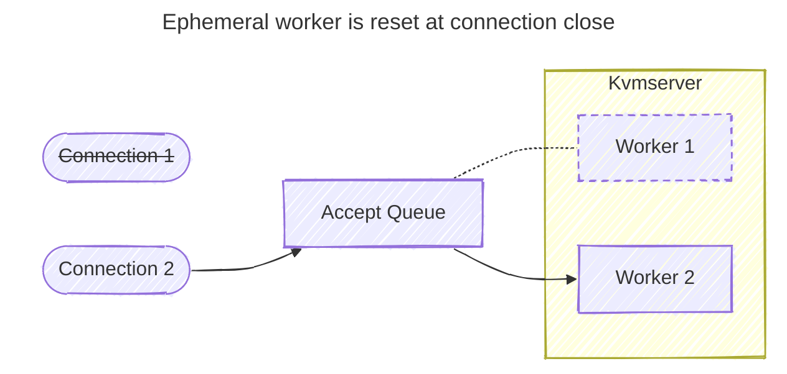
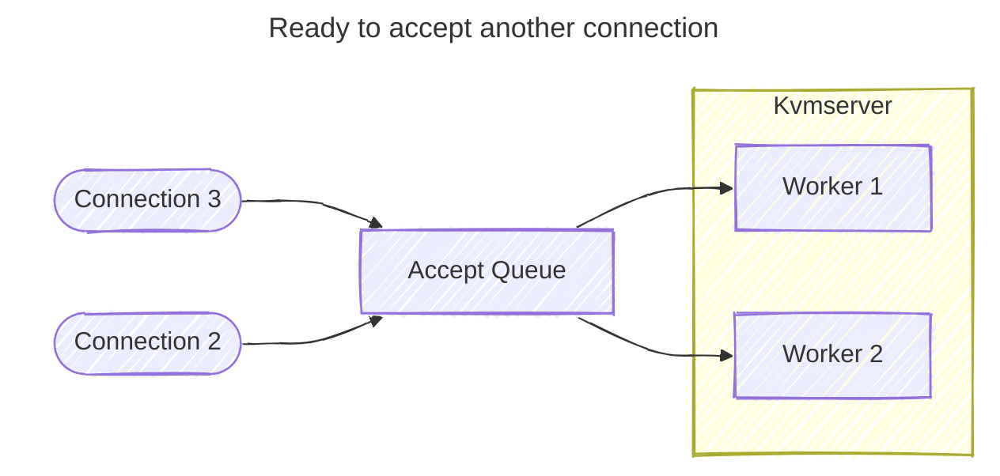

# Kvmserver - Fast per-request isolation for Linux executables with TinyKVM.

Kvmserver applies [TinyKVM](https://github.com/varnish/tinykvm)'s fast sandboxing technology to existing Linux server executables to provide per request isolation with extremely low overhead.

Kvmserver works by intercepting the server's epoll event loop so each accepted connection is handled by a forked copy of the process running as a TinyKVM guest.
After each connection TinyKVM resets the guest to a pristine state far more quickly than Linux is able to fork a process.
TinyKVM is able to achieve such extremely fast reset times by running the guest processes under an emulated Linux userspace in KVM.

This approach is particularly useful for JIT'ed runtimes where existing options require choosing between fast execution with virtualization, process forking, or v8 isolates; or fast sandbox reset with webassembly.

> Deno performance stats

Previous experiments with this real world React rendering benchmark have shown runtimes in the 10s of milliseconds with webassembly (which does not support JIT) or reset times of several milliseconds to either fork a process or start a new V8 isolate.

## Performance characterization

Execution of processes inside KVM generally runs at full speed.
Any syscalls requiring communication with the host incur overhead of around a microsecond in VM context switching and permission checking between guest and host.
Guest reset time is proportional to the number of dirty memory pages which must be reset.

For simple endpoints the network stack overhead from establishing a new tcp connection can be significant so best performance is achieved by listening on a unix socket and serving incoming tcp connections through a reverse proxy to enable client connection reuse.

## Benchmarks

Deno native:
```sh
$ ./wrk -c1 -t1 http://127.0.0.1:8080
Running 10s test @ http://127.0.0.1:8080
  1 threads and 1 connections
  Thread Stats   Avg      Stdev     Max   +/- Stdev
    Latency    12.04us   17.13us   1.89ms   99.24%
    Req/Sec    85.20k     9.94k   96.70k    72.28%
  855810 requests in 10.10s, 126.51MB read
Requests/sec:  84739.32
Transfer/sec:     12.53MB

$ ./wrk -c1 -t1 http://127.0.0.1:8000
Running 10s test @ http://127.0.0.1:8000
  1 threads and 1 connections
  Thread Stats   Avg      Stdev     Max   +/- Stdev
    Latency    15.50us  137.91us   6.20ms   99.71%
    Req/Sec    99.79k    11.03k  106.20k    93.07%
  1002164 requests in 10.10s, 148.14MB read
Requests/sec:  99223.33
Transfer/sec:     14.67MB
```
Deno has good performance. 12us on average single-threaded. With single-threaded it also has to GC every once in a while, which adds acts as a large speed bump.

Deno sandboxed in TinyKVM:
```sh
$ ./wrk -c1 -t1 http://127.0.0.1:8000
Running 10s test @ http://127.0.0.1:8000
  1 threads and 1 connections
  Thread Stats   Avg      Stdev     Max   +/- Stdev
    Latency    15.50us    1.72us 126.00us   93.03%
    Req/Sec    63.61k     2.35k   65.78k    88.12%
  638961 requests in 10.10s, 94.45MB read
Requests/sec:  63264.87
Transfer/sec:      9.35MB

$ ./wrk -c64 -t64 http://127.0.0.1:8000
Running 10s test @ http://127.0.0.1:8000
  64 threads and 64 connections
  Thread Stats   Avg      Stdev     Max   +/- Stdev
    Latency    68.30us   97.70us  11.34ms   99.04%
    Req/Sec    15.61k     6.90k   32.44k    77.84%
  10038128 requests in 10.10s, 1.45GB read
Requests/sec: 993829.98
Transfer/sec:    146.91MB
```
Deno in TinyKVM has around ~4us in context-switching and safety overhead per request. But has good scaling with forked VMs.

## Per-request isolation

```sh
$ ./wrk -c1 -t1 http://127.0.0.1:8000 -H "Connection: close"
Running 10s test @ http://127.0.0.1:8000
  1 threads and 1 connections
  Thread Stats   Avg      Stdev     Max   +/- Stdev
    Latency    60.61us    5.35us 206.00us   83.50%
    Req/Sec    13.40k   478.54    14.12k    62.38%
  134615 requests in 10.10s, 22.34MB read
Requests/sec:  13329.30
Transfer/sec:      2.21MB
```
There is natural overhead in establishing a new connection for each request, but that's a necessary part of isolating each request. After each request the VM is completely reset, ready to go again. This benchmark is running an unmodified Deno stable binary with no special code or FFI. :)

```sh
$ whereis deno
deno: /home/gonzo/.deno/bin/deno
$ deno
Deno 2.3.1
```

## React page-rendering benchmark

Running a React benchmark we find:
```sh
-= TinyKVM w/Deno ephemeral with reset as tail-latency =-

$ ./wrk -c1 -t1 http://127.0.0.1:8000 -H "Connection: close"
Running 10s test @ http://127.0.0.1:8000
  1 threads and 1 connections
  Thread Stats   Avg      Stdev     Max   +/- Stdev
    Latency   592.71us   26.35us   0.93ms   81.31%
    Req/Sec     1.66k    14.66     1.68k    76.24%
  16636 requests in 10.10s, 496.09MB read
Requests/sec:   1647.23
Transfer/sec:     49.12MB

-= TinyKVM w/Deno ephemeral including reset =-

$ ./wrk -c1 -t1 http://127.0.0.1:8000 -H "Connection: close"
Running 10s test @ http://127.0.0.1:8000
  1 threads and 1 connections
  Thread Stats   Avg      Stdev     Max   +/- Stdev
    Latency   756.92us   40.21us   3.96ms   99.42%
    Req/Sec     1.30k     6.52     1.30k    77.23%
  13036 requests in 10.10s, 388.74MB read
Requests/sec:   1290.72
Transfer/sec:     38.49MB

-= Deno run terminal =-

$ ./wrk -c1 -t1 http://127.0.0.1:8000 -H "Connection: close"
Running 10s test @ http://127.0.0.1:8000
  1 threads and 1 connections
  Thread Stats   Avg      Stdev     Max   +/- Stdev
    Latency   582.90us  511.51us  11.36ms   98.10%
    Req/Sec     1.83k   181.40     1.93k    94.00%
  18236 requests in 10.00s, 543.81MB read
Requests/sec:   1823.58
Transfer/sec:     54.38MB
```
There is only a 10us difference between terminal `deno run` and sandboxed TinyKVM with resets as tail latency.

## How it works







