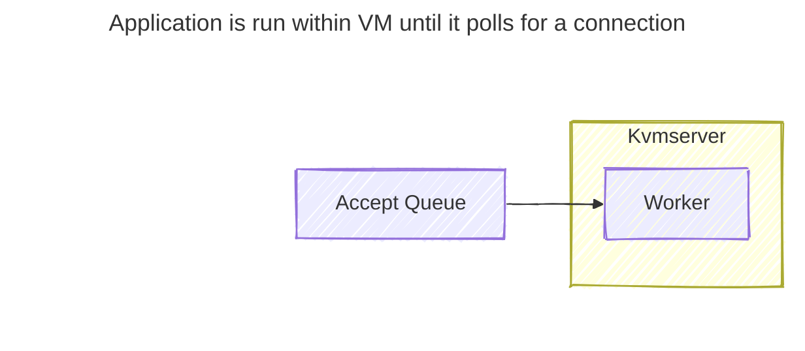
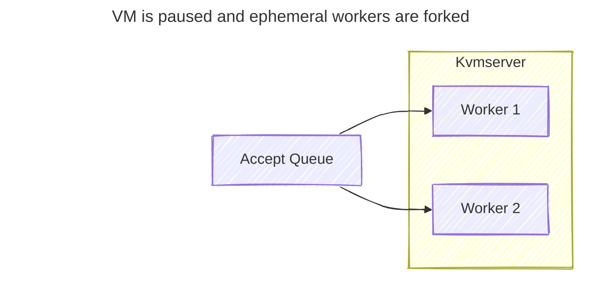
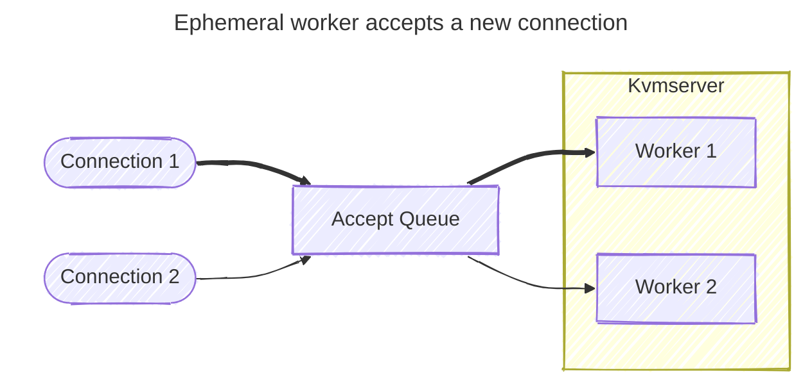
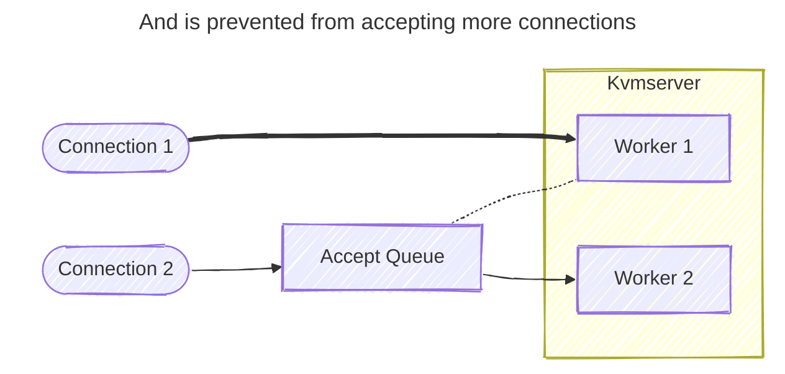
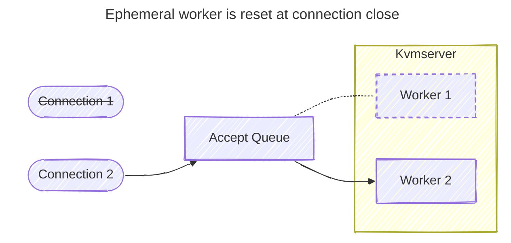
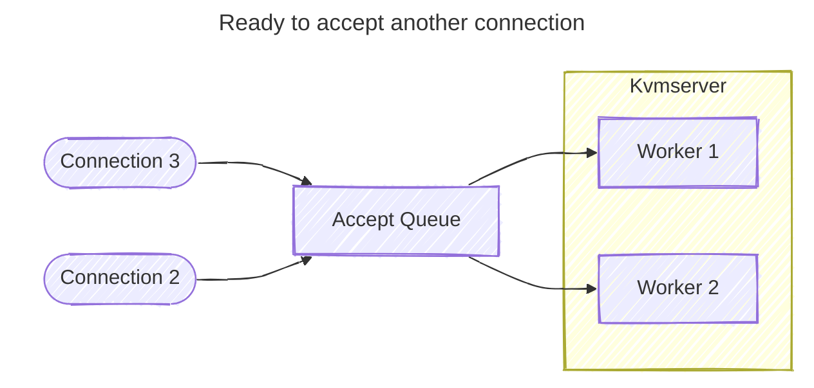

# Kvmserver - Fast per-request isolation for Linux executables with TinyKVM

Kvmserver applies [TinyKVM](https://github.com/varnish/tinykvm)'s fast
sandboxing technology to existing Linux server executables to provide per
request isolation with extremely low overhead.

Kvmserver works by intercepting the server's epoll event loop so each accepted
connection is handled by a forked copy of the process running as a TinyKVM
guest. After each connection TinyKVM resets the guest to a pristine state far
more quickly than Linux is able to fork a process. TinyKVM is able to achieve
such extremely fast reset times by running the guest processes under an emulated
Linux userspace in KVM.

This approach is particularly useful for JIT'ed runtimes where existing options
require choosing between fast execution with virtualization, process forking, or
v8 isolates; or fast sandbox reset with webassembly.

Previous experiments with this real world React rendering benchmark have shown
runtimes in the 10s of milliseconds with webassembly (which does not support
JIT) or reset times of several milliseconds to either fork a process or start a
new V8 isolate. With Kvmserver we are able to run this benchmark with just 85µs
of overhead.

## Benchmarks

### Rust minimal http server

| name                                  | average | p50   | p90   | p99   |
| ------------------------------------- | ------- | ----- | ----- | ----- |
| base                                  | 13 µs   | 11 µs | 17 µs | 20 µs |
| kvmserver threads=1                   | 23 µs   | 20 µs | 29 µs | 33 µs |
| kvmserver ephemeral threads=1         | 28 µs   | 28 µs | 30 µs | 37 µs |
| kvmserver ephemeral threads=2         | 34 µs   | 33 µs | 37 µs | 51 µs |
| kvmserver ephemeral threads=4         | 36 µs   | 35 µs | 39 µs | 57 µs |
| kvmserver ephemeral threads=2 no tail | 28 µs   | 28 µs | 32 µs | 36 µs |

### Deno helloworld

| name                                  | average | p50   | p90   | p99   |
| ------------------------------------- | ------- | ----- | ----- | ----- |
| base (reusing connection)             | 11 µs   | 10 µs | 14 µs | 16 µs |
| base                                  | 17 µs   | 15 µs | 22 µs | 29 µs |
| kvmserver threads=1                   | 33 µs   | 32 µs | 33 µs | 45 µs |
| kvmserver ephemeral threads=1         | 50 µs   | 49 µs | 53 µs | 75 µs |
| kvmserver ephemeral threads=2         | 58 µs   | 57 µs | 62 µs | 90 µs |
| kvmserver ephemeral threads=4         | 60 µs   | 59 µs | 65 µs | 90 µs |
| kvmserver ephemeral threads=2 no tail | 41 µs   | 38 µs | 46 µs | 59 µs |

### Deno react renderer

| name                                  | average | p50    | p90    | p99    |
| ------------------------------------- | ------- | ------ | ------ | ------ |
| base (reusing connection)             | 642 µs  | 606 µs | 673 µs | 805 µs |
| base                                  | 646 µs  | 619 µs | 670 µs | 820 µs |
| kvmserver threads=1                   | 649 µs  | 619 µs | 674 µs | 798 µs |
| kvmserver ephemeral threads=1         | 695 µs  | 689 µs | 712 µs | 790 µs |
| kvmserver ephemeral threads=2         | 705 µs  | 704 µs | 722 µs | 755 µs |
| kvmserver ephemeral threads=4         | 711 µs  | 710 µs | 728 µs | 758 µs |
| kvmserver ephemeral threads=2 no tail | 639 µs  | 634 µs | 662 µs | 721 µs |

### Benmark details

- Non-ephemeral benchmark shows the overhead of sandboxing without any reset
  between requests.
- No-tail benchmark runs with only a single load generator connection to measure
  latency excluding time spent after the response is sent to the client.
- Deno is run with `--v8-flags=--predictable` which causes all work to happen on
  thread. (At median this makes a 1.5% difference for the React benchmark and
  none for helloworld.)
- 1000 warmup requests were used to warm the JIT before benchmarking.
- `deno compile` was used to avoid starting background disk cache threads.
- The Rust minimal http server always closes connections.
- Benchmarks were run on AMD Ryzen 9 7950X (32) @ 5.881Ghz with deno 2.3.6.

## Performance characterization

The React benchmark runs with 10µs of connection creation overhead, 15µs of
sandbox execution overhead, and 55µs of sandbox reset overhead for a total of
80µs out of 690µs. Performance is more consistent since reset avoids JIT spikes.

- Execution of processes inside KVM generally runs at full speed.
- Any syscalls requiring communication with the host incur overhead of around a
  microsecond in VM context switching and permission checking.
- VM reset accounts for most of the overhead. It is tail latency incurred after
  connection close and consists of:
  - Event loop / file descriptor reset, proportional to the number of open file
    descriptors.
  - Memory reset time, proportional to the number of dirty memory pages which
    must be reset.

For simple endpoints the network stack overhead from establishing a new tcp
connection can be significant so best performance is achieved by listening on a
unix socket and serving incoming tcp connections through a reverse proxy to
enable client connection reuse.

Running under nested virtualization incurs additional overhead of around 200µs.

## Memory usage

Kvmserver forks are very memory efficient since they only need allocate for
pages written during a request (which are reset afterwards). This is great for
largely single-threaded JITs like V8 since a large RSS can be amortized over
many forked VMs.

A simple benchmark rendering the same page over and over is the best case
scenario. Expect real-world usage to touch more pages, but will still see
substantial savings.

| Program                  | RSS    | Reset   |
| ------------------------ | ------ | ------- |
| Rust minimal http server | 9 MB   | 68 KB   |
| Deno hello world         | 102 MB | 452 KB  |
| Deno react renderer      | 162 MB | 2324 KB |

## Command line arguments

```
kvmserver [OPTIONS] program [args...]


POSITIONALS:
  program TEXT REQUIRED       Program
  args TEXT ...               Program arguments

OPTIONS:
  -h,     --help              Print this help message and exit
  -c,     --config [kvmserver.toml]
                              Read a toml file
          --cwd TEXT [/home/lrowe/devel/kvmserver/.build]
                              Set the guests working directory
          --env TEXT ...      add an environment variable
  -t,     --threads UINT [1]  Number of request VMs (0 to use cpu count)
  -e,     --ephemeral         Use ephemeral VMs
  -w,     --warmup UINT [0]   Number of warmup requests
  -v,     --verbose           Enable verbose output
          --print-config      Print config and exit without running program

Permissions:
          --allow-all Excludes: --allow-read --allow-write --allow-env --allow-net --allow-connect --allow-listen --volume
                              Allow all access
          --allow-read{/} Excludes: --allow-all
                              Allow filesystem read access
          --allow-write{/} Excludes: --allow-all
                              Allow filesystem write access
          --allow-env{*} Excludes: --allow-all
                              Allow access to environment variables. Optionally specify
                              accessible environment variables (e.g.
                              --allow-env=USER,PATH,API_*).
          --allow-net Excludes: --allow-all
                              Allow network access
          --allow-connect Excludes: --allow-all
                              Allow outgoing network access
          --allow-listen Excludes: --allow-all
                              Allow incoming network access
          --volume Excludes: --allow-all
                              <host-path>:<guest-path>[:r?w?=r]

Advanced:
          --max-boot-time FLOAT [20]
          --max-request-time FLOAT [8]
          --max-main-memory UINT [8192]
          --max-address-space UINT [131072]
          --max-request-memory UINT [128]
          --limit-request-memory UINT [128]
          --shared-memory UINT [0]
          --dylink-address-hint UINT [2]
          --heap-address-hint UINT [256]
          --hugepage-arena-size UINT [0]
          --hugepage-requests-arena UINT [0]
          --no-executable-heap{false}
          --hugepages
          --no-split-hugepages{false}
          --transparent-hugepages
          --no-relocate-fixed-mmap{false}
          --no-ephemeral-keep-working-memory{false}
          --remapping ...     virt:size(mb)[:phys=0][:r?w?x?=rw]
```

## Configuration file

By default kvmserver will look for a file named `kvmserver.toml` in the current
directory and if it exists read configuration from it.

Command line arguments and configuration are handled by
[CLI11](https://github.com/CLIUtils/CLI11) which supports a subset of
[TOML](https://toml.io/). Notably array values must be kept to a single line.

## How it works












